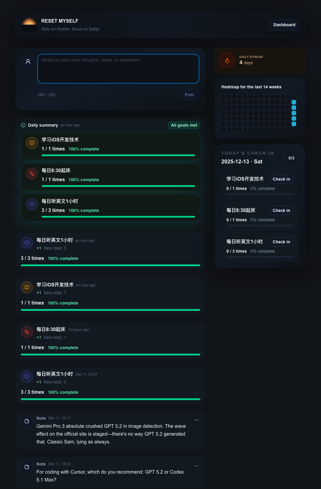
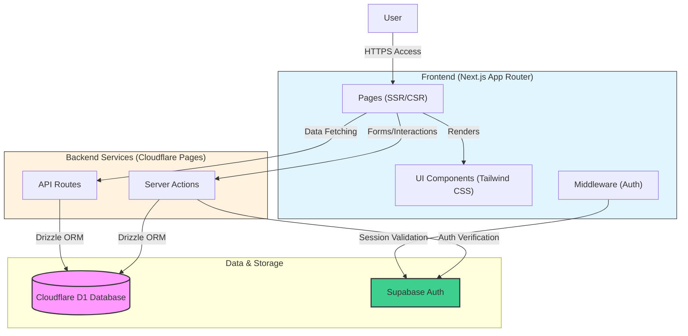

This project is a personal goal tracking and self-management application built with Next.js, Cloudflare D1, and Supabase.
Key features include visual timeline recording, daily habit check-ins, and goal progress monitoring to help users continuously track personal growth.
With a clean, modern interface and efficient data synchronization, it allows users to focus on self-reset and improvement.

## System Architecture

